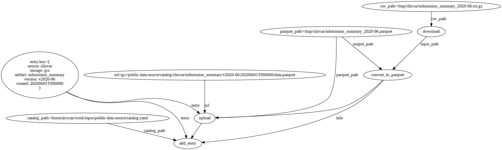

# Public Data Source Catalog

The purpose of this repository is to act as the point-of-entry for all external data sources in a workflow.  The source code within contains utilities for working with these sources as well as a catalog model for managing metadata and links related to versioned datasets.  Common problems this attempts to solve are:

- Unifying derived or imported mappings between nomenclature systems
  - Gene, trait, and protein entities often share mappings when scoped to a particular type of analysis
- Sharing ontology subsets or extractions
  - EFO extractions are messy and often require derived fields to be useful in a pipeline relying on tabular data, e.g. all descendents of a term
- Centralizing target entity sets
  - Pipelines often start with a notion of target genes, phenotypes or proteins and these high priority sets should be shareable
- Building data snapshots from continuously updated (or poorly regulated) sources
  - Data from APIs or FTP services with no standard release schedule should be compiled into immutable artifacts for downstream operations
- Aggregating documentation for sources
  - This is a natural place to explain what data a source provides along with schema info, summary notebooks, and exploratory analyses 

The utilities in this repository only suppose that all workstreams agree on the *metadata* necessary to define these things above.  At the moment, this just means that a best effort is made to "export" the information used by a pipeline as entries in a [catalog.yaml](catalog.yaml) file.  This should contain the minimum amount of links, parameters, version strings and documentation that make it possible for two different projects to agree on the same way to access data for a source (but the particulars of using the data are up to the implementer -- this "catalog" only points to where it lives).

### Usage

The typical flow for adding a new data source is:

1. Add a folder to [`import`](import) for the new source
2. Create a script that does the following:
    - Download and repackage artifacts from scientific dbs into more portable, efficient formats
    - Create a catalog entry that represents the artifact, e.g.
      ```python
        from data_source import catalog
        entry = catalog.create_entry(
            source='clinvar',
            slug='submission_summary',
            version='v2020-06',
            created=pd.to_datetime('2020-06-01').to_pydatetime(),
            format='parquet',
            type='file'
        )
        # This will add the entry to the default `catalog.yaml` file
        catalog.add_entry(entry)
      ```
    - Upload optimized files to a remote file store, e.g.
      ```python
        url = entry.resources['parquet']
        # url = gs://public-data-source/catalog/clinvar/submission_summary/v2020-06/20200601T000000/data.parquet
        entry.fs.upload('/tmp/submission_summary.parquet', url)
      ```
3. In another project that requires access to versioned datasets, use the catalog code to get urls for an artifact or explore those available, e.g.

```python
from data_source import catalog
from pyspark.sql.session import SparkSession
spark = SparkSession.builder.getOrCreate()

# Load some catalog or merge multiple of them
catalog_url = 'https://raw.githubusercontent.com/related-sciences/public-data-source/master/catalog.yaml'
cat = catalog.load(catalog_url)

# Select an artifact to donwload or get URLs for
path = cat.download('clinvar', 'submission_summary', version='latest')
# path = /tmp/data_source_cache/catalog/clinvar/submission_summary/v2020-06/20200601T000000/data.parquet

# Alternatively, use the remote urls:
# cat.find('clinvar', 'submission_summary')[0].url
# gs://public-data-source/catalog/clinvar/submission_summary/v2020-06/20200601T000000/data.parquet

df = spark.read.parquet(path)
df.select('#VariationID', 'ClinicalSignificance', 'SubmittedPhenotypeInfo').show(5, 50)
+------------+----------------------+--------------------------------------------------+
|#VariationID|  ClinicalSignificance|                            SubmittedPhenotypeInfo|
+------------+----------------------+--------------------------------------------------+
|           2|            Pathogenic|        SPASTIC PARAPLEGIA 48, AUTOSOMAL RECESSIVE|
|           3|            Pathogenic|                             SPASTIC PARAPLEGIA 48|
|           4|Uncertain significance|    RECLASSIFIED - VARIANT OF UNKNOWN SIGNIFICANCE|
|           5|            Pathogenic|MITOCHONDRIAL COMPLEX I DEFICIENCY, NUCLEAR TYP...|
|           5|            Pathogenic|                                      Not Provided|
+------------+----------------------+--------------------------------------------------+
only showing top 5 rows
```

### Scripting

A helpful feature in data integration scripts, especially those interacting with private sources, is being able to see what they would do before you run them.  This is particularly useful for data sources that update irregularly and require some attention after each update (which is most of them).  A good solution for this rather than programming dry-run flags is to first define integration scripts as DAGs for introspection.  The [clinvar.py](import/clinvar/clinvar.py) script is a good example of this where Prefect decorators make it easy to lift code in an eagerly evaluated program into a DAG.  The first step in any session to run the script then (e.g. [import/clinvar/session.ipynb](import/clinvar/session.ipynb)) might look like this:

```bash
python clinvar.py flow - visualize --filename=flow --format=png
```




Then to run it after making sure the paths/buckets/urls are all correct:

```bash
python clinvar.py flow - run
```

### Environment Management

Environment variables related to authentication and storage are managed in one of three ways:

1. Secret variables (e.g. passwords and paths to key files) are not handled explicitly
    - These should be managed by the user, e.g. by setting env vars when running containers
2. Public variables common to groups of code with the same privileges are set in `.env` files
    - Bucket/project names are a good example of this
    - For code using the same storage/authentication properties, a `.env` file should be loaded
    at the beginning of each process.
3. Conflicting variables for code that needs settings from multiple environments should load the appropriate variables from `.env` files and set the corresponding properties explicitly on python objects
    - An example of this would be any pipeline needing to access both private and public data
    - Variable values don't need to come from `.env` files, but this makes it easier to
    keep code using both methods in sync
