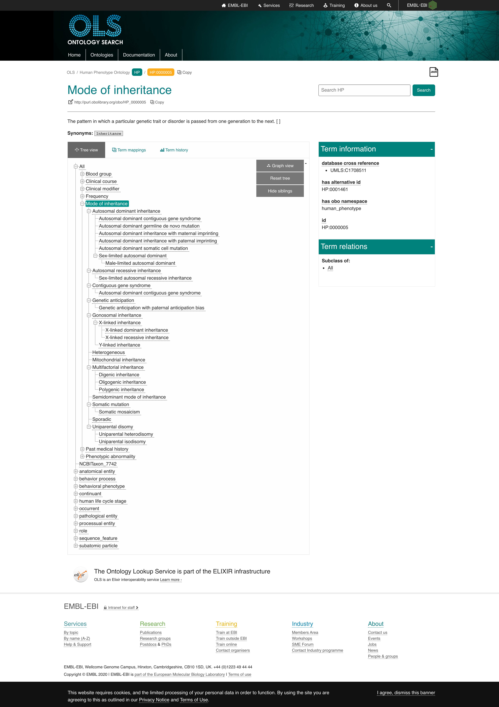

## HPO 

Human Phenotype Ontology (HPO) downloads are available from: https://hpo.jax.org/app/download/annotation

The above points to here: http://compbio.charite.de/jenkins/job/hpo.annotations/lastStableBuild/

This contains a `genes_to_phenotype.txt` csv which, as it turns out, simply repeats properties for diseases across genes associated with those diseases.  In other words, inheritance is only specific to diseases and the repitition in this file is simply for convenience. Proof:

```python
import pandas as pd
(
    pd.read_csv(
        'http://compbio.charite.de/jenkins/job/hpo.annotations/lastSuccessfulBuild/artifact/util/annotation/genes_to_phenotype.txt', 
        names=[
            'entrez-gene-id',
            'entrez-gene-symbol',
            'HPO-Term-Name',
            'HPO-Term-ID',
            'Frequency-Raw',
            'Frequency-HPO',
            'Additional Info from G-D source',
            'G-D source',
            'disease-ID for link'
        ],
        sep='\t', 
        skiprows=1, 
        header=None
    )
    .groupby(['disease-ID for link', 'entrez-gene-id'])
    # For each disease + gene, get list of HPO terms for concepts like 
    # 'Autosomal recessive inheritance', 'Short stature', 'Seizure', etc.
    # Note that HPO-Term-Name is actually the ID while ID is the name
    # -- they have the headers reversed in their file
    .apply(lambda g: ','.join(sorted(g['HPO-Term-Name'].unique())))
    .rename('terms').reset_index()
    .groupby('disease-ID for link')['terms'].nunique().value_counts()
)
# 1    7317
# Name: terms, dtype: int64
```

### Modes of Inheritance

See all possible HPO modes of inheritance at https://hpo.jax.org/app/browse/term/HP:0000005 ("hierarchy" on the left).

In OLS, it is much easier to see the HPO tree from here: https://www.ebi.ac.uk/ols/ontologies/hp/terms?iri=http%3A%2F%2Fpurl.obolibrary.org%2Fobo%2FHP_0000005&viewMode=All&siblings=true


